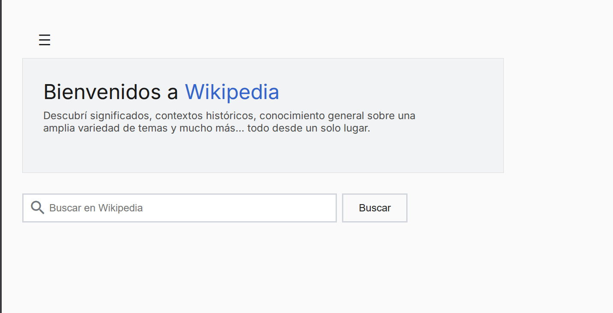

## Wikipedia.js

Buscador enciclopédico simple construido con HTML, CSS y JavaScript que consume la API REST de Wikipedia en español.

**Características**

→ Búsqueda de artículos en Wikipedia.  
→ Manejo de páginas con desambiguación.  
→ Interfaz inspirada en Wikipedia.  
→ Menú lateral interactivo.  
→ Diseño responsive.  
→ Sin dependencias externas de JavaScript.

**Tecnologías**

→ HTML5.  
→ CSS3 (Custom Properties / Design Tokens).  
→ JavaScript (ES6+).  
→ Wikipedia REST API.

**API utilizada**

→ **Endpoint:** `https://es.wikipedia.org/api/rest_v1/page/summary/{término}` 
→ **Fuente de contenido:** Wikipedia (es)

**Accesibilidad**

→ Uso de roles semánticos.
 
→ Etiquetas ARIA en elementos interactivos.
 
→ Navegación básica por teclado.

**Licencia**

Este proyecto es solo con fines educativos y de aprendizaje.  
El contenido mostrado pertenece a Wikipedia y se rige por sus licencias.
